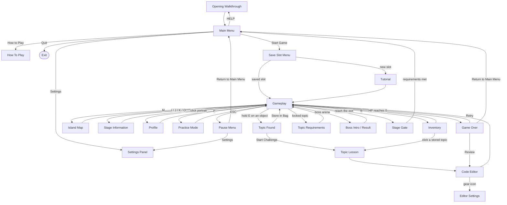

# CodeBreak Screen Flow

**Status:** v2, traced 31 August 2026, findings acted on 5 September 2026.
**Owner:** software design.

Every screen in the game: how you get into it, how you get out, and what it
does to the screen behind it. Traced from the event handlers rather than
from memory, so this describes what the build actually does today.

---

## 1. The map

The **Opening Walkthrough runs before the main menu on every launch**, not
only the first one, and the menu's HELP button replays it.

---

## 2. Behaviour table

| Screen | Opens by | Closes by | Pauses play | Background | Returns to |
|---|---|---|---|---|---|
| Opening Walkthrough | Launch, or HELP | SPACE past the last page, ESC | — | own | Main Menu |
| Main Menu | Launch | Quit button | — | animated backdrop | exits the game |
| Save Slot Menu | Start Game | ESC | — | menu backdrop | Main Menu |
| How To Play | Menu button | ESC, BACKSPACE, BACK | — | blurred snapshot | Main Menu |
| Settings Panel | Menu or Pause | ESC, ENTER, BACK | yes, via pause | blurred snapshot | wherever it opened from |
| Tutorial | New save slot, or P in game | finishing it; ESC skips | n/a | own | Gameplay |
| Gameplay | Slot chosen | — | — | — | — |
| Inventory | B | B, ESC | yes | frame snapshot | Gameplay |
| Island Map | M | M, ESC, click off the sheet | yes | frame snapshot | Gameplay |
| Stage Information | I, J, K, O, or the rail buttons | ESC | yes | frame snapshot | Gameplay |
| Profile | Click the portrait card | ESC, BACK | yes | blurred snapshot | Gameplay |
| Topic Found | Finishing a hold-E search | ESC, or choosing an option | yes | frame snapshot | Gameplay or Lesson |
| Topic Lesson | Start Challenge, or a stored topic | ESC, or continuing | yes | frame snapshot | Editor or Gameplay |
| Topic Requirements | Touching a locked topic | ESC | yes | frame snapshot | Gameplay |
| Code Editor | Lesson, or Game Over → Review | ESC (guarded), close button | yes | frame snapshot | Gameplay |
| Editor Settings | Gear icon in the editor | ESC, ENTER, CLOSE | — | dims the editor | Editor |
| Boss Intro / Result | Entering or resolving the boss fight | E, SPACE, ENTER, ESC | yes | frame snapshot | Gameplay |
| Stage Gate | Reaching the stage exit | E, SPACE, ENTER, ESC | yes | frame snapshot | Gameplay, or Main Menu on exit |
| Game Over | HP reaches 0 | one of its three buttons | n/a | blurred snapshot | Gameplay or Main Menu |

---

## 3. Conventions that already hold

These are real patterns in the code. Keep new screens inside them.

1. **ESC closes the topmost thing, never the game.** Every screen except
   the main menu honours it.
2. **A screen opened by a letter key closes with the same key.** B closes
   the bag, M closes the map. A new keyed screen should make its key a
   toggle too.
3. **Modals never draw over a live frame.** Each takes a snapshot of the
   frame behind it and blurs or dims it, so the world reads as suspended
   rather than half-visible.
4. **Modals pause gameplay.** Nothing moves behind an open panel.
5. **Left mouse button only.** The wheel and the right button also raise
   `MOUSEBUTTONDOWN`, and handlers that checked only the event type used to
   fire on a scroll. Every click handler tests `event.button == 1`.
6. **The screen that opens a modal decides what happens next.** Panels
   report a choice back rather than launching the next screen themselves,
   which is why the gameplay loop is the only place that knows the order of
   things.

---

## 4. Inconsistencies found

| # | Finding | Verdict |
|---|---|---|
| 1 | ~~The main menu has no keyboard support at all~~ | **Fixed 5 Sep.** Up/Down walk its five controls, Enter activates, a blue ring shows the selection, and moving the mouse hands control back to it. |
| 2 | **F1 and F2 mean two different things** — light and fog out in the world, light and dark editor themes inside the editor. Both are player features now; the debug keys moved to F3–F8. | **Left as they are, and documented.** The screens are modal so the keys never collide at runtime, and F1 meaning "lighter" in both places is consistent enough. The manual now says so out loud. |
| 3 | **BACKSPACE has four meanings**: closes How To Play, goes back a page in the intro, and deletes a character in both the save-slot password field and the settings font-size field. | Leave, but never promote it to a global "back" — two screens have text fields that need it. |
| 4 | ~~Two bindings no manual mentions~~ | **Fixed.** P was added by the practice-mode work; the map's wheel-zoom and R reset were added 5 Sep. The manual's columns now tighten their own spacing, because this list has outgrown them twice. |
| 5 | **Finishing a stage is a dead end.** Passing the gate marks the stage complete, saves, and returns to the main menu. There is no stage-to-stage handoff. | Known. Belongs to the Stage 2 work. |
| 6 | **Settings exists twice** — the menu/pause panel and the editor's own. They share state, so values never disagree, but they are two widgets to maintain. | Accept. The editor needs its own because it repaints itself in the theme being previewed. |
| 7 | **Game Over accepts a different key set** to every other modal: ESC, ENTER, M and R. | Accept. It is a decision screen, not a panel, and the keys match its three buttons. |
| 8 | **The Code Editor deliberately resists ESC.** | Keep, and document it — losing typed code to a stray ESC is what that guard prevents. |

---

## 5. Suggested fixes, in order

1. ~~Add the undocumented keys to the shared control list~~ — done 5 Sep.
2. ~~Move the editor's theme shortcuts off F1 and F2~~ — decided against;
   documented instead.
3. ~~Give the main menu keyboard navigation~~ — done 5 Sep.
4. Revisit the stage-completion dead end when Stage 2 has a map.
5. Settings now survive closing the game, so a returning player keeps their
   volume, theme, text speed and text size.
